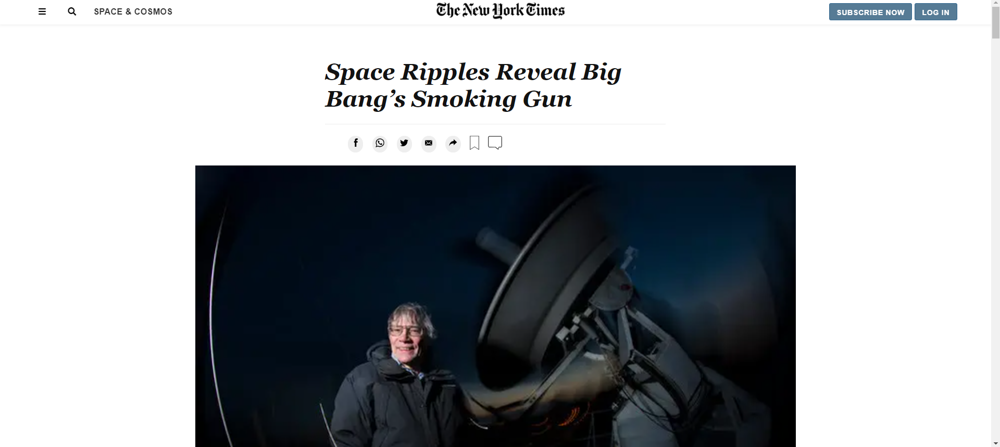

New York Times Article Page

> The project was completed with html and css. It involves building a replica of this article on 
New York Times to experiment with the inclusion of multimedia content and practice positioning techniques like Grid, Flex and Floats.

Additional description about the project and its features.

## Built With

- HTML
- CSS
- Flexbox

## Live Demo

[Live Demo Link](https://tmampa.github.io/New-York-Times-Article/)

## Authors

👤 **Tshephang Mampa**

- GitHub: [@tmampa](https://github.com/tmampa)
- Twitter: [@tshephangm_](https://twitter.com/tshephangm_)
- LinkedIn: [Tshephang Mampa](https://www.linkedin.com/in/tshephang-mampa-9235951a1)

## 🤝 Contributing

Contributions, issues, and feature requests are welcome!

Feel free to check the [issues page](https://github.com/tmampa/New-York-Times-Article/issues/2).

## Show your support

Give a ⭐️ if you like this project!

## Acknowledgments

- Hat tip to anyone whose code was used (w3schools.com)
- Inspiration
- etc
